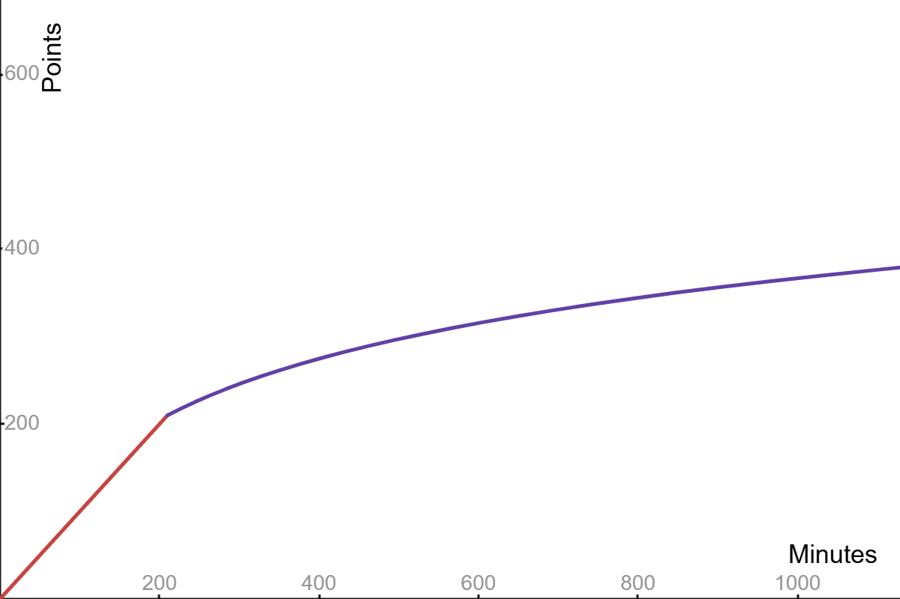

# UMMB Summer Workout Program

### Point Algorithm

Let $t_{mw}$ be the activity time (in minutes) performed by member $m$ during week $w$. Let $p_{mw}$ be the corresponding number of points earned by member $m$ in week $w$, calculated as $p_{mw}=f(t_{mw})$, where\
$$f(t)=\begin{cases} t & 0\leq t\leq 210 \\\log_{1.01}(\frac{t}{210})+210 & t > 210\end{cases},$$
a piecewise function that looks like this:

For the first 210 minutes (corresponding to 30 minutes a day) that a member completes in a week, they get a point for every minute. For each additional minute completed beyond 210 in a week, the member will receive a progressively diminishing amount of points.

Let $p_{sw}$ be the number of points earned by a section $s$ during week $w$. This is computed as an average of all of the section's members' points for the given week,\
$$p_{sw}=\frac{\sum_{m\in s}p_{mw}}{|s|}.$$ The total points for each section across all weeks is thus $p_{s}=\sum_{w}p_{sw}.$

It should be noted that the size of each section may change at some point throughout the summer, as main round auditions come in and additional rookies are added. Thus the size of each section $|s|$ is to be computed on a weekly basis.